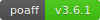

.. image:: http://pascal.bazile.free.fr/paraglidingFolder/divers/GPS/OpenAir-Format/img/Paragliding-OpenAir-FrenchFiles_SiaEurocontrol.jpg
   :target: `Paragliding OpenAir French Files`_
   :alt: `Paragliding OpenAir French Files`_

poaff - `Paragliding OpenAir French Files`_
==============

Programme d'extraction et de formatage par lots ; basé sur des données issues des standards AIXM_ :code:`(Aeronautical Information Exchange Modele)` et XML_ du SIA-France_ :code:`(Service de l'Information Aéronautique)`.
Ces traitements sont nécessaires pour la génération des centaines de cartographies publiées sur le blog `Paragliding OpenAir French Files`_.
Les données sources utilisés pour la contruction de ce site sont majoritairement issues des sources officielles SIA-France_ et Eurocontrol_.
Vous pouvez également suivre les évolutions via la page `Paragliding OpenAir French Files (on Facebook)`_.

.. code::

	/!\ ATTENTION: Seules des données officielles doivent êtres utilisées pour la navigation aérienne.
	/!\ WARNING  : Only official data must be used for air navigation

**Table of Contents**

.. contents::
   :backlinks: none
   :local:

Périmètre géographique couvert
------------------------------
.. image:: http://pascal.bazile.free.fr/paraglidingFolder/divers/GPS/OpenAir-Format/img/geoPOAFF_border_20201210.jpg
   :target: http://pascal.bazile.free.fr/paraglidingFolder/divers/GPS/OpenAir-Format/img/geoPOAFF_border_20201210.jpg
   :alt: geoPOAFF_border
  
  
Exemples de cartographies vol-libre
-----------------------------------
Cartographie vol-libre (FreeFlight) couvrant l'intégralité des territoires Français:

.. image:: http://pascal.bazile.free.fr/paraglidingFolder/divers/GPS/OpenAir-Format/img/geoFrenchAll_sample_GeoJSON.jpg
   :target: http://pascal.bazile.free.fr/paraglidingFolder/divers/GPS/OpenAir-Format/img/geoFrenchAll_sample_GeoJSON.jpg
   :alt: FrenchAreas

Cartographie vol-libre (FreeFlight) couvrant la France-métropolitaine:

.. image:: http://pascal.bazile.free.fr/paraglidingFolder/divers/GPS/OpenAir-Format/img/geoFrench_sample_GeoJSON.jpg
   :target: http://pascal.bazile.free.fr/paraglidingFolder/divers/GPS/OpenAir-Format/img/geoFrench_sample_GeoJSON.jpg
   :alt: French
   
   
Quelques autres exemples de cartographies vol-libre (FreeFlight):

.. image:: http://pascal.bazile.free.fr/paraglidingFolder/divers/GPS/OpenAir-Format/img/20201020_GlobalView-1.jpg
   :target: http://pascal.bazile.free.fr/paraglidingFolder/divers/GPS/OpenAir-Format/img/20201020_GlobalView-1.jpg
   :alt: OtherFrench

Installation
------------
geojson is compatible with Python 3.6, 3.7 and 3.8. The recommended way to install is via pip_:

.. code::

	pip install -r requirements.txt

Utilisation
-----------

.. code:: python

	>>> #!/usr/bin/env python3  
	>>> $ python3 poaff.py  

Licence
-------
`Licence-GPL3`_

Crédit
------
* `Pascal Bazile`_ main developper

Liens externes
--------------
.. [1] `Paragliding OpenAir French Files`_ - On Web
.. [2] `Paragliding OpenAir French Files (on OpenData)`_ - On OpenData France
.. [3] `Paragliding OpenAir French Files (on Facebook)`_ - On Facebook
.. [4] `Paragliding OpenAir French Files (on GitHub)`_ - Crédit `Pascal Bazile`_ - Programme de construction des cartographies `Paragliding OpenAir French Files`_ aux formats (GeoJSON_ ; `Openair New Format`_ et KML_)
.. [5] aixmParser_ - Crédit `Pascal Bazile`_ - Programme d'interprétation du format AIXM_ pour transformations aux formats (GeoJSON_ ; `Openair New Format`_)
.. [6] openairParser_ - Crédit `Pascal Bazile`_ - Programme d'interprétation du format Openair_ pour transformaion AIXM_
.. [7] `Carte OACI France`_ - Scan digitalisé
.. [8] SIA-France_ - Service de l'Information Aéronautique
.. [9] Eurocontrol_ - A pan-European, civil-military organisation dedicated to supporting European aviation
.. [10] AIXM_ - Aeronautical Information Exchange Modele
.. [11] XML_ - W3C Standard
.. [12] KML_ - Google Documentation
.. [13] `Openair Format`_ - Openair Documentation historique
.. [14] `Openair New Format`_ - Documentation des nouvelles évolutions du format Openair

.. _Pascal Bazile: https://github.com/BPascal-91/
.. _Paragliding OpenAir French Files: http://pascal.bazile.free.fr/paraglidingFolder/divers/GPS/OpenAir-Format/
.. _Paragliding OpenAir French Files (on Facebook): https://www.facebook.com/Paragliding-OpenAir-FrenchFiles-102040114894513/
.. _Paragliding OpenAir French Files (on OpenData): https://www.data.gouv.fr/fr/datasets/cartographies-aeriennes-dediees-a-la-pratique-du-vol-libre/
.. _Paragliding OpenAir French Files (on GitHub): https://github.com/BPascal-91/poaff/
.. _Carte OACI France: https://www.geoportail.gouv.fr/donnees/carte-oaci-vfr
.. _SIA-France: https://www.sia.aviation-civile.gouv.fr/
.. _aixmParser: https://github.com/BPascal-91/aixmParser/
.. _openairParser: https://github.com/BPascal-91/openairParser/
.. _Eurocontrol: https://www.eurocontrol.int/
.. _AIXM: http://www.aixm.aero/
.. _Openair Format: http://www.winpilot.com/UsersGuide/UserAirspace.asp
.. _Openair New Format: http://pascal.bazile.free.fr/paraglidingFolder/divers/GPS/OpenAir-Format/
.. _XML: https://www.w3.org/TR/xml/
.. _KML: https://developers.google.com/kml/documentation
.. _GeoJSON: http://geojson.org/
.. _pip: http://www.pip-installer.org
.. _Licence-GPL3: https://www.gnu.org/licenses/gpl-3.0.html

